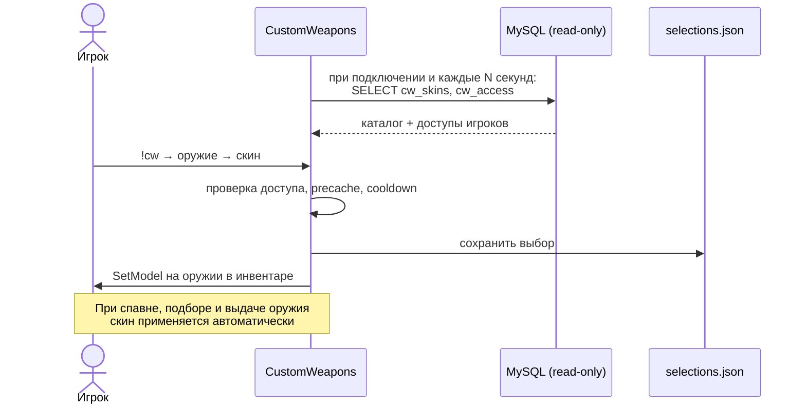
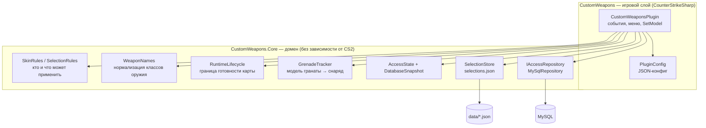
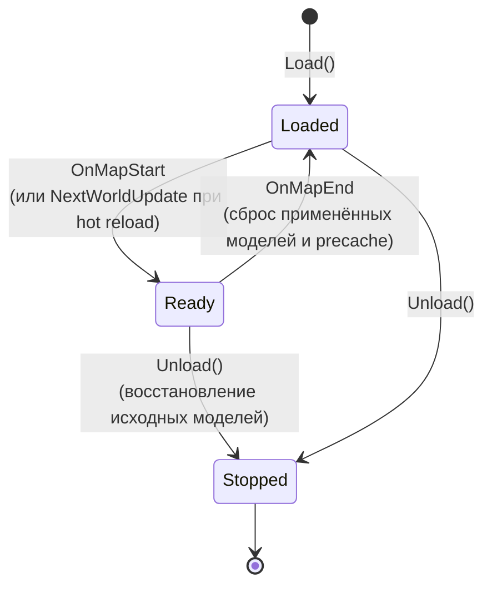

# CustomWeapons

[](https://github.com/koiie111/CustomWeapons/actions/workflows/build.yml)
[](https://github.com/koiie111/CustomWeapons/releases/latest)
[](LICENSE)

Плагин **CounterStrikeSharp** для CS2 (.NET 10), который заменяет модели оружия.

- Игрок выбирает скин через центральное меню `!cw`.
- Права на скины читаются из уже существующей MySQL-базы (`cw_access`, `cw_skins`), только `SELECT`.
- Выбор игрока хранится локально в JSON.
- VIPCore и сторонние плагины меню **не нужны**.

> [!WARNING]
> **Статус v1.0.2.** Сборка, unit-тесты и MySQL-интеграция проходят в CI. Работа моделей на живом CS2-сервере (вид от первого/третьего лица, ножи, гранаты) **ещё не проверена**. Перед запуском на рабочем сервере пройдите [игровой чек-лист](docs/TESTING.md).

## Содержание

- [Быстрый старт](#быстрый-старт)
- [Как это работает](#как-это-работает)
- [Архитектура](#архитектура)
- [Конфигурация](#конфигурация)
- [База данных и права доступа](#база-данных-и-права-доступа)
- [Правила выбора и применения скинов](#правила-выбора-и-применения-скинов)
- [Хранение выбора и обновление плагина](#хранение-выбора-и-обновление-плагина)
- [Диагностика](#диагностика)
- [Разработка](#разработка)
- [Лицензия](#лицензия)

---

## Быстрый старт

### Требования

| Компонент | Версия |
| --- | --- |
| CS2 dedicated server | Linux x64 или Windows x64 |
| Metamod:Source | актуальная |
| CounterStrikeSharp | **1.0.375+** с runtime .NET 10 |
| MySQL | 8.x (в CI — 8.4; MariaDB не проверялась) |
| Контент моделей | `.vmdl` и зависимости доступны **серверу и клиентам** (например, через Workshop) |

Файлы моделей в релиз не входят — права на них принадлежат их авторам.

### Установка

1. Скачайте `CustomWeapons-v1.0.2.zip` из [Releases](https://github.com/koiie111/CustomWeapons/releases/latest).
2. Распакуйте папку `addons` в `game/csgo/`.
3. Отредактируйте `addons/counterstrikesharp/configs/plugins/CustomWeapons/CustomWeapons.json` ([пример](configs/CustomWeapons.json)).
4. Установите контент с моделями на сервер и сделайте его доступным клиентам.
5. Перезапустите сервер **или** загрузите плагин и **смените карту** — precache моделей выполняется только при старте карты.
6. В игре: `!cw` / `!customweapons` в чате, `css_cw` / `css_customweapons` в консоли.

```text
game/csgo/addons/counterstrikesharp/
├── plugins/CustomWeapons/
│   ├── CustomWeapons.dll            # игровой слой (CSS)
│   ├── CustomWeapons.Core.dll       # доменная логика
│   ├── MySqlConnector.dll
│   ├── CustomWeapons.deps.json
│   ├── CustomWeapons.runtimeconfig.json
│   └── data/selections.json         # создаётся автоматически
└── configs/plugins/CustomWeapons/CustomWeapons.json
```

> [!NOTE]
> Не копируйте `CounterStrikeSharp.API.dll` в папку плагина — его предоставляет сервер.

---

## Как это работает



1. **Каталог** скинов задаётся в JSON-конфиге: какой скин к какому оружию относится и какая у него модель.
2. **Доступ** к приватным скинам берётся из `cw_access` по SteamID64. `cw_skins` может переименовать или отключить скин.
3. **Выбор** игрока сохраняется по категории оружия и применяется ко всему текущему и будущему оружию этого типа.
4. Плагин **ничего не пишет в БД**: выдача, продление и отзыв доступов остаются задачей вашего магазина или панели.

---

## Архитектура

Решение разделено на два проекта. Бизнес-правила изолированы от движка CS2, поэтому их можно тестировать без запуска игрового сервера.



### Слои

| Слой | Проект | Ответственность | Зависит от |
| --- | --- | --- | --- |
| **Игровой** | `src/CustomWeapons` | Регистрация событий, меню, команды, применение/восстановление моделей, таймеры | CounterStrikeSharp, Core |
| **Домен** | `src/CustomWeapons.Core` | Правила доступа, выбор скина, валидация конфига, нормализация оружия, жизненный цикл | — |
| **Инфраструктура** | `src/CustomWeapons.Core` | Чтение MySQL, атомарная запись JSON | MySqlConnector, `System.Text.Json` |
| **Тесты** | `tests/CustomWeapons.Tests` | Unit-тесты домена + интеграция с MySQL | Core |

Зависимости направлены внутрь: `Core` ничего не знает о CS2, а игровой слой обращается к БД через интерфейс `IAccessRepository`.

### Компоненты Core

| Файл | Что делает |
| --- | --- |
| [`Definitions.cs`](src/CustomWeapons.Core/Definitions.cs) | Модели конфига (`WeaponDefinition`, `SkinDefinition`, `DatabaseOptions`), снимок БД, `SkinRules` (проверка доступа и валидация), `WeaponNames` (M4A1-S/USP-S/CZ75/R8/MP5-SD, ножи, снаряды гранат) |
| [`SelectionRules.cs`](src/CustomWeapons.Core/SelectionRules.cs) | Какой скин применить: ручной выбор → иначе первый доступный из конфига |
| [`MySqlRepository.cs`](src/CustomWeapons.Core/MySqlRepository.cs) | Параметризованные `SELECT` из `cw_skins` и `cw_access`; `AccessState` — флаг «данные актуальны» |
| [`SelectionStore.cs`](src/CustomWeapons.Core/SelectionStore.cs) | Хранилище выбора: последовательная запись через временный файл, резервная копия повреждённого JSON |
| [`RuntimeLifecycle.cs`](src/CustomWeapons.Core/RuntimeLifecycle.cs) | Откладывает регистрацию игровых хуков до `OnMapStart` (защита от краша при холодной загрузке) |
| [`GrenadeTracker.cs`](src/CustomWeapons.Core/GrenadeTracker.cs) | Короткий (≤ 2 с) снимок удерживаемой гранаты для переноса модели на брошенный снаряд |

### Жизненный цикл плагина



До перехода в `Ready` плагин не перебирает игроков и не регистрирует игровые события. После успешного перехода в логе появляются строки:

```text
CustomWeapons 1.0.2 loaded; waiting for map readiness.
CustomWeapons runtime ready; player access refresh started.
```

---

## Конфигурация

Файл: `configs/plugins/CustomWeapons/CustomWeapons.json`. Полный пример с шестью скинами лежит в [configs/CustomWeapons.json](configs/CustomWeapons.json).

### Общие параметры

| Поле | По умолчанию | Описание |
| --- | --- | --- |
| `ConfigVersion` | `1` | Версия формата CounterStrikeSharp |
| `ServerId` | `1` | ID сервера. `0` — учитывать доступы с любым `sid` |
| `CooldownSeconds` | `1` | Пауза между ручными сменами скина; `0` — без паузы |
| `SaveSelections` | `true` | `true` — сохранять выбор в JSON; `false` — только до отключения игрока |
| `RefreshIntervalSeconds` | `60` | Период опроса MySQL, минимум `5` |
| `Database` | — | Подключение к MySQL (см. ниже) |
| `Weapons` | 4 категории | Оружие и его скины |

> `SaveSelections` заменяет старый `use_client_cookies`. Это серверный JSON-файл, а не клиентские cookies и не таблица в БД.

### Подключение к MySQL

```json
"Database": {
  "Host": "127.0.0.1",
  "Port": 3306,
  "Database": "customweapons",
  "Username": "customweapons",
  "Password": "",
  "PasswordEnvironmentVariable": "CW_DB_PASSWORD",
  "SslMode": "Preferred",
  "TimeoutSeconds": 10
}
```

- **Пароль.** Если переменная окружения из `PasswordEnvironmentVariable` существует, пароль берётся из неё, иначе — из `Password`. Чтобы использовать только `Password`, укажите пустую строку.
- **SSL.** `Preferred` подходит для локальной базы. Для удалённой базы с сертификатами используйте `VerifyFull`.
- **Права.** Пользователю БД нужен только `SELECT` на `cw_access` и `cw_skins`.
- Не публикуйте заполненный конфиг.

### Добавление скина

```json
"weapon_awp": {
  "Name": "AWP",
  "Skins": {
    "awp_animes": {
      "Name": "AWP - Перлика",
      "Model": "models/weapons/kolka/pak_4/awp/awp_animes.vmdl",
      "Private": true,
      "Hide": true
    }
  }
}
```

| Элемент | Правило |
| --- | --- |
| Ключ оружия (`weapon_awp`) | Класс `weapon_*` в нижнем регистре. Можно добавлять любые существующие классы, включая ножи и гранаты |
| Ключ скина (`awp_animes`) | ID скина, совпадает с `cw_access.model` / `cw_skins.model`. Уникален во всём конфиге, до 64 символов, с учётом регистра. **Это не путь к модели** |
| `Model` | Путь вида `models/…/*.vmdl`, только прямые `/`, без `..` |
| `Private` | `true` — нужна запись в `cw_access`; `false` — доступен всем |
| `Hide` | `true` — скрыть скин без доступа; `false` — показать как заблокированный |

Порядок скинов в `Skins` важен: при автовыборе берётся **первый доступный**.

После изменения конфига перезагрузите плагин и **смените карту**.

> [!TIP]
> ID и пути из примера (включая `m4a1s_daeldalus` и `awp_isane`) сохранены как есть. Сверьте их со своим контентом.

---

## База данных и права доступа

Плагин не создаёт таблицы и не изменяет данные. Используются только эти колонки:

| Таблица | Колонки | Назначение |
| --- | --- | --- |
| `cw_access` | `steamid64`, `model`, `sid`, `expires` | Кому и какой скин выдан |
| `cw_skins` | `model`, `name`, `active` | Переопределение имени и отключение скина |

Колонки `price`, `fake_price`, `is_discount`, `type`, `video`, `img` игнорируются.

### Когда доступ действует

Запись в `cw_access` подходит, если **все** условия верны:

1. `steamid64` совпадает с игроком, `model` совпадает с ID скина.
2. `sid = 0` (глобальный доступ), **или** `sid = ServerId`, **или** в конфиге `ServerId = 0`.
3. `expires = 0` (бессрочно) **или** `expires` больше текущего Unix-времени UTC **в секундах**.

Если подходящих записей несколько, достаточно одной.

### Роль `cw_skins`

- Если строки нет, скин всё равно работает по JSON-конфигу.
- Непустой `name` заменяет имя из конфига.
- При `active != 1` скин отключён.
- Если для одного `model` есть противоречащие друг другу строки, скин блокируется, а в лог пишется предупреждение.

### Обновление и отказ БД

- Доступы загружаются при подключении игрока, затем раз в `RefreshIntervalSeconds`.
- Срок `expires` проверяется в момент применения, без ожидания следующего опроса.
- Пока доступы не загружены или последний опрос завершился ошибкой, **новые приватные скины не применяются**. Публичные скины продолжают работать.

---

## Правила выбора и применения скинов

**Выбор**

- Один выбор на игрока (SteamID64) и категорию оружия, без разделения по командам.
- Выбирать можно до покупки оружия и будучи мёртвым.
- **Ручной выбор приоритетнее всего**, включая явный выбор «Стандартная модель».
- **Автовыбор.** Если игрок ещё ничего не выбирал для категории, применяется первый доступный и загруженный скин. Автовыбор не сохраняется как ручной.
- Если сохранённый скин стал недоступен, новое оружие остаётся стандартным. Другой скин не подставляется, а сам выбор не удаляется.

**Передача оружия**

- Оформленный экземпляр **сохраняет модель** при выбрасывании и подборе, даже если у нового владельца нет доступа.
- Новый владелец может вручную выбрать свой скин или вернуть стандартную модель.
- Истечение или отзыв доступа и `active != 1` блокируют новые применения, но уже нанесённую модель не снимают.

**Ножи и гранаты**

- `weapon_knife` работает как общая категория для всех ножей без точного совпадения класса. Игровой тип ножа не меняется.
- Для HE, flashbang, smoke, decoy, molotov/incendiary и snowball модель переносится на брошенный снаряд. Берётся модель фактически брошенной гранаты, а не выбор бросившего. *Требует игровой проверки.*

**Чего плагин не делает:** не выдаёт оружие и не меняет урон, боезапас, экономику, subclass и тип ножа.

> [!CAUTION]
> Не используйте одновременно несколько плагинов, которые меняют модель одного и того же оружия: результат будет зависеть от порядка обработчиков.

---

## Хранение выбора и обновление плагина

- Выбор хранится в `plugins/CustomWeapons/data/selections.json`. Запись идёт последовательно, через временный файл и атомарную замену.
- Повреждённый JSON сохраняется как `selections.json.corrupt-<UTC timestamp>`, после чего создаётся новый файл.
- При ошибке записи выбор остаётся в памяти, но может не пережить перезапуск. Причина пишется в лог.

**Обновление**

1. Сделайте резервную копию конфига и папки `data`.
2. Замените файлы плагина, сохранив **свой конфиг и `data`**.
3. Перезапустите сервер или смените карту.

При корректной выгрузке плагин возвращает оружию исходные модели. При аварийном завершении процесса последние записи на диск могут не сохраниться.

---

## Диагностика

| Симптом | Что проверить |
| --- | --- |
| В меню только «Стандартная модель» | `Private`/`Hide`, точный SteamID64 и ID скина, `sid`, `expires`, `active`, подключение к MySQL |
| Пометка «после смены карты» | Плагин загружен посреди карты — смените карту |
| Ошибка обновления MySQL в логе | Хост, порт, имя БД, пароль, SSL, права `SELECT`. Пароль и строка подключения в лог не выводятся |
| Скин пропал из каталога | Ключ в JSON, конфликтующие строки `cw_skins`, `active` |
| Модель невидима или ошибка ресурса | Наличие `.vmdl` и материалов у сервера и клиента, регистр пути, совместимость модели |
| После подбора остался чужой скин | Это ожидаемо: выберите свой скин или стандартную модель |
| Выбор не сохраняется | `SaveSelections`, права на запись в `plugins/CustomWeapons/data`, ошибки диска |

### Краш `A callback was made on a garbage collected delegate`

1. Полностью остановите процесс сервера. Горячая замена не очищает callbacks, оставшиеся в нативном движке.
2. Замените файлы плагина, сохранив конфиг и `data`.
3. Запустите сервер заново.

В v1.0.2 исправлены ранний вызов `GetPlayers` и выгрузка после неудачной загрузки. Если ошибка повторится, приложите к issue полный лог от запуска (особенно строки `Failed to load plugin`) и core dump.

---

## Разработка

Нужны **.NET 10 SDK** и Git. PowerShell 7 требуется только для упаковки.

```sh
dotnet restore --locked-mode
dotnet build -c Release --no-restore
dotnet test  -c Release --no-build
pwsh -File scripts/package.ps1      # → artifacts/CustomWeapons-v*.zip + SHA256SUMS.txt
```

### Структура репозитория

```text
.
├── src/
│   ├── CustomWeapons/           # игровой слой: плагин CounterStrikeSharp
│   └── CustomWeapons.Core/      # домен и инфраструктура, без зависимости от CS2
├── tests/CustomWeapons.Tests/   # xUnit: правила, хранилище, жизненный цикл, MySQL
├── configs/CustomWeapons.json   # пример конфигурации
├── scripts/package.ps1          # сборка релизного ZIP
├── docs/TESTING.md              # автоматические и ручные проверки
└── .github/workflows/build.yml  # CI: build → test (MySQL 8.4) → package
```

### Тесты

- **Unit-тесты** проверяют матрицу `server`/`sid`/`expires`, дубликаты в каталоге, отказ и восстановление БД, нормализацию оружия, снимки гранат, сохранение и повреждение JSON, жизненный цикл и автовыбор.
- **Интеграция с MySQL** включается переменной `CW_TEST_MYSQL`. Тест **создаёт таблицы и пользователя**, поэтому запускайте его только на одноразовой базе с именем `cw_test_*`. Без переменной тест пропускается.
- **Игровая проверка** выполняется вручную по чек-листу из [docs/TESTING.md](docs/TESTING.md).

История изменений — в [CHANGELOG.md](CHANGELOG.md).

---

## Лицензия

Исходный код распространяется по [GPL-3.0-only](LICENSE).

Технический референс — [ByDexterTR / CustomWeaponModel](https://github.com/ByDexterTR/CS2Plugins/blob/main/VIPCore/modules/CustomWeaponModel.cs) (precache и `SetModel` с восстановлением исходной модели). CustomWeapons реализован отдельно и не требует VIPCore. MIT-уведомление автора сохранено в [licenses/ByDexter-MIT.txt](licenses/ByDexter-MIT.txt).

Ссылки: [CounterStrikeSharp](https://github.com/roflmuffin/CounterStrikeSharp) · [документация CSS](https://docs.cssharp.dev/) · [сторонние зависимости](THIRD-PARTY-NOTICES.md)
